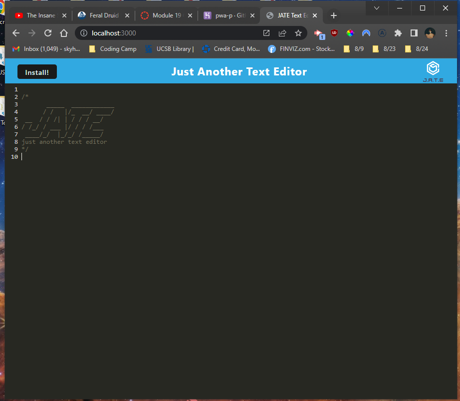

# PWA Text Editor Refactor

This downloadable text editor uses a webpack to cache assets, including scripts, images and CSS. While most of the PWA was already built, this project focused on refactoring and writing some additional code for things like IndexedDB, the installation prompts and the webpack config in general.

The reason for refactoring and building this application was to develop a better understanding of webpack and more importantly the development/production phases of each. In addition developing this application helped to strengthen my understanding of caching assets and user data with IDB. 

Most of the issues I ran into were resolved once I realized clearing the page cache would be a good idea after modifying and implementing new code as the old cache prevented me from seeing how certain assets were actually implemented.

## Table of Contents
- [Usage/Examples](#usage)
- [Installation process](#installation-process)
- [Screenshots](#screenshots)
- [Deployed Project](#deployed-project)
- [Credits](#credits)
- [License](#license)

## Usage

For usage of this application users can write code or just general text into the editor, save their information when navigating away from the page and/or when returing to the page. A user can also "install" the application with the install button which will then pop out the page for use on the side. 

## Installation process

To start the server a user must first install the required dependancies for both the server and client folders, so using `npm install` will prompt `cd server && npm i && cd ../client && npm i` thus installing both packages for our folders. Then a user must build the server with `npm run build` and finally `npm start dev` or `npm start` for dev builds and production builds.

## Screenshots

As shown below, this is what the text editor will look like upon load

# Deployed Project

* [Repository](https://github.com/skytexier/PWA-Text-Editor)
* [Heroku Deployment](https://pwa-p.herokuapp.com/)

## Credits

For this refactoring I referred to previous works with PWA and the myriad of tools we can use for things like data storage, caches and service workers.

- Stackoverflow as always [https://stackoverflow.com/](https://stackoverflow.com/)

- MDN Web Docs: PWA [https://developer.mozilla.org/en-US/docs/Web/Progressive_web_apps](https://developer.mozilla.org/en-US/docs/Web/Progressive_web_apps)

- ChatGPT for general questions about code snippets [https://openai.com/blog/chatgpt/](https://openai.com/blog/chatgpt/)

## License
MIT License
 
Copyright (c) [2022] [Sky Hamilton Texier]
 
Permission is hereby granted, free of charge, to any person obtaining a copy
of this software and associated documentation files (the "Software"), to deal
in the Software without restriction, including without limitation the rights
to use, copy, modify, merge, publish, distribute, sublicense, and/or sell
copies of the Software, and to permit persons to whom the Software is
furnished to do so, subject to the following conditions:
 
The above copyright notice and this permission notice shall be included in all
copies or substantial portions of the Software.
 
THE SOFTWARE IS PROVIDED "AS IS", WITHOUT WARRANTY OF ANY KIND, EXPRESS OR
IMPLIED, INCLUDING BUT NOT LIMITED TO THE WARRANTIES OF MERCHANTABILITY,
FITNESS FOR A PARTICULAR PURPOSE AND NONINFRINGEMENT. IN NO EVENT SHALL THE
AUTHORS OR COPYRIGHT HOLDERS BE LIABLE FOR ANY CLAIM, DAMAGES OR OTHER
LIABILITY, WHETHER IN AN ACTION OF CONTRACT, TORT OR OTHERWISE, ARISING FROM,
OUT OF OR IN CONNECTION WITH THE SOFTWARE OR THE USE OR OTHER DEALINGS IN THE
SOFTWARE.

 

